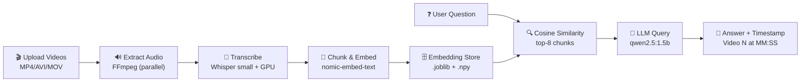

<div align="center">

# 🤖 RAG Teaching Assistant

*Drop lecture videos in. Ask questions. Get answers with exact timestamps.*

<br/>


<br/>

[](https://github.com/underratedgitter/RAG-teaching-assistant/commits/main)
[](https://github.com/underratedgitter/RAG-teaching-assistant)

</div>

---

## 📌 Overview

A fully local desktop app that turns hours of lecture recordings into an AI-powered Q&A system — no cloud, no API keys, no subscriptions. Just your GPU doing the work.

```
You:  "How does gradient descent work?"
App:  "In Video 2 at 14:30, the instructor explains that gradient descent
       iteratively adjusts parameters by computing partial derivatives..."
```

---

## 🆚 Manual vs AI-Assisted Lecture Review

| Feature | Manual Method | AI-Assisted |
|:---|:---|:---|
| **Time** | 30–60 min to find info | < 1 second query |
| **Effort** | Tedious scrubbing | Instant answers |
| **Understanding** | Passive note-taking | Deep context |
| **Format** | Short notes/bookmarks | Full context + timestamp |
| **Search** | By timeline only | Semantic/meaning-based |
| **Context** | Missing relationships | All related concepts |

> **Result:** 50–100× Faster · Better Learning Retention · Searchable Knowledge Base

---

## 🏗️ Architecture



---

## ✨ Features

| Feature | Details |
|:---|:---|
| 🔒 **100% Local** | Runs entirely on your machine — no data leaves your PC |
| ⚡ **GPU Accelerated** | CUDA-powered Whisper transcription with fp16 for speed |
| 🧩 **Smart Chunking** | Overlapping 150-word segments for full context retrieval |
| 🕐 **Timestamp References** | Every answer points back to video + exact time |
| 🚀 **Fast Retrieval** | Precomputed embeddings + cosine similarity in milliseconds |
| 🔥 **Model Pre-warming** | Models loaded on startup — zero cold-start lag |

---

## 🛠️ Tech Stack

| Component | Tool | File |
|:---|:---|:---|
| Desktop UI | Tkinter | `dashboard.py` |
| Video → Audio | FFmpeg (parallel, up to 4x) | `video_to_mp3.py` |
| Speech → Text | OpenAI Whisper (`small`) + fp16 | `mp3_to_json.py` |
| Text → Vectors | Ollama + `nomic-embed-text` | `preprocess_json.py` |
| Question → Answer | Ollama + `qwen2.5:1.5b` | `dashboard.py` |
| Similarity Search | scikit-learn cosine similarity | `dashboard.py` |
| Data Storage | pandas, numpy, joblib | `preprocess_json.py` |

---

## 📁 Project Structure

```
RAG-teaching-assistant/
├── dashboard.py            # The brain — UI, orchestration, Q&A
├── video_to_mp3.py         # Rips audio from videos (parallel)
├── mp3_to_json.py          # Whisper transcription → timestamped chunks
├── preprocess_json.py      # Chunk merging + embedding generation
└── requirements.txt        # Python dependencies
```

Generated at runtime:
```
videos/                     # Your uploaded videos
audios/                     # Extracted MP3 files
jsons/                      # Transcript JSONs
embeddings.joblib           # Searchable embedding database
embedding_matrix.npy        # Precomputed similarity matrix
```

---

## 📊 Data Flow & Storage (1-hour lecture)

| Stage | Format | Estimated Size | Reduction |
|:---|:---|:---|:---|
| 1. Video Files | MP4, AVI, MOV | ~1 GB | — |
| 2. Audio Extract | MP3 | ~100 MB | 10× |
| 3. Transcription | JSON Chunks | ~10 MB | 100× |
| 4. Embeddings | Vectors | ~5 MB | 50× |
| 5. Similarity Matrix | Precomputed | ~500 KB–5 MB | 5× |
| 6. Query Result | Cached Text | ~1–5 KB | 1000× |

---

## 🤖 Ollama Models

| Model | Role | Why |
|:---|:---|:---|
| `nomic-embed-text` | Embedding | Converts text to vectors for semantic search |
| `qwen2.5:1.5b` | Generation | Small, fast LLM that fits in ~2 GB VRAM |

---

## ⚡ Performance

> Designed to run well on a laptop GPU (tested on RTX 3050 4 GB).

- **Parallel conversion** — FFmpeg processes up to 4 videos simultaneously
- **fp16 inference** — halves Whisper's GPU memory and doubles speed
- **Smart chunking** — overlapping 150-word chunks beat tiny sentence fragments for retrieval
- **Batch embeddings** — 128 chunks per API call instead of one-by-one
- **Precomputed matrix** — similarity search runs in milliseconds, not seconds
- **Model pre-warming** — both models loaded on startup, zero cold-start lag
- **Connection pooling** — HTTP sessions reused across all Ollama calls
- **Threaded UI** — processing never freezes the interface

---

## 🚀 Quick Start

```bash
# 1. Install dependencies
pip install -r requirements.txt

# 2. Make sure FFmpeg is in PATH
ffmpeg -version

# 3. Start Ollama
ollama serve

# 4. Pull models (first time only)
ollama pull nomic-embed-text
ollama pull qwen2.5:1.5b

# 5. Launch
python dashboard.py
```

---

## 📖 Usage

1. **Upload Videos** — click the button, select your lecture files (`.mp4`, `.avi`, `.mkv`, `.mov`)
2. **Process Videos** — one click kicks off the full pipeline (audio → transcript → embeddings)
3. **Ask Questions** — type naturally, hit Enter or click Ask
4. **Read the Answer** — complete with video number and timestamp

---

## 🔧 Troubleshooting

| Problem | Fix |
|:---|:---|
| Can't connect to Ollama | Run `ollama serve` first |
| No embeddings / no answers | Re-process videos from the dashboard |
| FFmpeg not found | Install FFmpeg and add to PATH |
| First query is slow | Wait for "Models warmed up" in terminal |
| Slow transcription | Use GPU-enabled PyTorch + CUDA; reduce parallel processes |

---

## 🔮 Future Improvements

- Smarter chunking strategies for better retrieval granularity
- Evaluation metrics for retrieval and answer quality
- Optional citation rendering from exact chunk timestamps
- Incremental indexing without full cache reset

---

## 📜 License

MIT © [Suraj Patel](https://github.com/underratedgitter)
